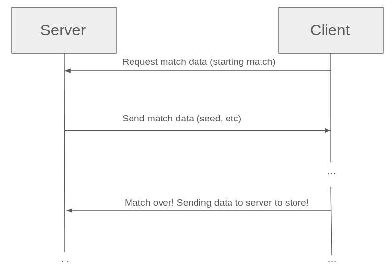

# cbmr
A server for SCP: Containment Breach ranked matches. Handles match data, including
- whether or not a player has forfeited / made a draw
- generating the seed for the specific category
- sending data back to the ranked client via HTTP requests
- storing player data in a database

## Architecture

# Usage of `cbmr`
TODO.

<!-- TODO: modernc.org/sqlite for sqlite -->

# Todolist
- [ ] Add skill-based matchmaking (based off ELOs).
- [ ] Add database to store
  - Updated ELO from match making
- [ ] Add authentication (discord)
- [ ] Support multiple matches running at the same time
- [ ] Rewrite CBMR in C/C++, Golang is only here for a quick and dirty implementation
- [ ] Clean (pretty much) the entire codebase up.

# Client Implementation Details
See [the implementation details](./example_clients/README.md)